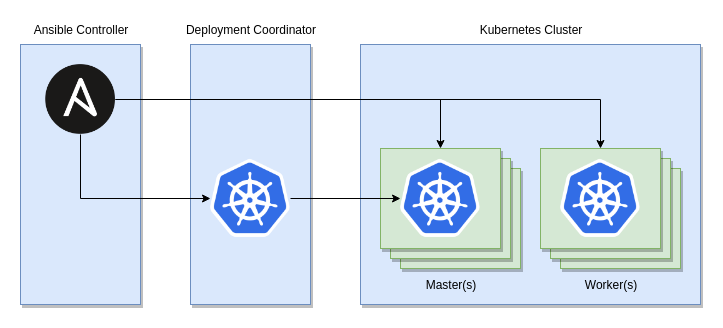
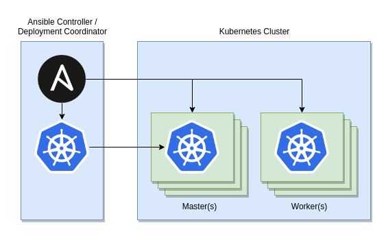
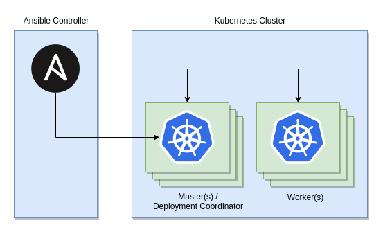
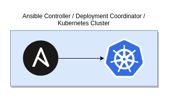

# k8s-ansible-playbooks-demo
Proof of technology for managing Kubernetes resources using Ansible playbooks.
Loosely based on the multi-tier Wordpress/MySQL example from
https://github.com/IBM/Scalable-WordPress-deployment-on-Kubernetes project.

## Quick start

### Prerequisites
1. Install Ansible. Consult [Installing the Control Node topic](https://docs.ansible.com/ansible/latest/installation_guide/intro_installation.html#installing-the-control-node)
   in Ansible Installation Guide.
2. Have a Kubernetes cluster. Any vendor will do. For example, you can deploy
   managed Kubernetes cluster on
   [IBM Cloud Kubernetes Service](https://www.ibm.com/cloud/container-service).
   For proof of concept purposes, you can also easily run a minimal cluster on
   your workstation, e.g.
   [using OKD](https://docs.okd.io/latest/getting_started/administrators.html#running-in-a-docker-container) or
   [using `kubeadm`](https://kubernetes.io/docs/setup/independent/create-cluster-kubeadm/).
3. Get `kubectl` utility. Consult [Install and Set Up kubectl](https://kubernetes.io/docs/tasks/tools/install-kubectl/).
   If you installed the cluster on your workstation, some vendors, such as
   OCP/OKD, will ship `kubectl` by default with their tooling.

### Preparations
1. In case of managed clusters, follow vendor documentation to set up cluster
   connectivity. It often requires getting `kubeconfig` file for your cluster
   (look for something like "Connect via CLI" in your vendor's web console),
   downloading a vendor-specific CLI as well as obtaining authorization token,
   e.g. by running `ibmcloud login` or `oc login`.
2. Ensure you can connect to the cluster from your workstation by running the
   `kubectl cluster-info` command.
3. Clone this repository.
4. In your repository clone root directory, copy `inventory.yaml_sample` to
   `inventory.yaml` and edit the `vars` section to match your cluster
   configuration. The demo code uses `NodePort` service to expose Wordpress
   application outside the cluster, which means the `kube_svc_external_access`
   variable should reference public address of the cluster node on which
   the Wordpress pod is scheduled. The automation code can be easily modified
   to use (and in the future will likely support OOTB)
   [`LoadBalancer` service](https://kubernetes.io/docs/concepts/services-networking/service/#loadbalancer)
   or
   [Ingress resources](https://kubernetes.io/docs/concepts/services-networking/ingress/).
   The `kube_config_file` variable can be modified to point to a custom
   `kubeconfig` file or removed entirely to use default `kubectl` lookup
   behavior.

### Deploy Wordpress service
1. From your terminal, change the current working directory to your repository
   clone root directory, that is the one containing `ansible.cfg` file.
2. Run the deploy playbook:
   ```
   $ ansible-playbook playbooks/deploy_wordpress_playbook.yaml
   ```
   To increase output verbosity, append `-v` option to the above command.
3. Navigate your browser to http://kube_svc_external_access:30180, replacing
   `kube_svc_external_access` with the cluster public address, as configured
   in the inventory file. You should now be presented with Wordpress language
   selection prompt.

## Conceptual and technological deep dive

### Objectives
Orchestrate deployment of containerized applications in a way that:
- is extremely simple to setup,
- relies on well established open source interfaces only (no vendor lock-in),
- does not require running a server or a daemon,
- is stateless,
- is idempotent,
- allows automating arbitrary actions at various application lifecycle phases,
- allows high (best unlimited) degree of customization,
- can become a piece of larger automation pipeline.

### Modeling Kubernetes ecosystem with Ansible concepts

Kubernetes provides means of expressing desired cluster state using declarative
object management and extensible object type model. While no doubt powerful,
in practice it can prove to be quite difficult approach to implementing complex
deployments, especially ones that require automation of lifecycle management
procedures, naturally fitting scripting languages. Unfortunately, introducing
scripts into Kubernetes resource definitions triggers several problems,
including mixing different syntax types in a single code unit and usability
issues, especially around testability. Finally, the declarative resource model
has very limited built-in support for customization (basically configmaps and
secrets).

A separate huge topic is how the actual object management takes place. Various
tools (elaborated more on in the
[Comparison with other available technologies](#comparison-with-other-available-technologies)
section further on) take different approaches, some of which lead to potential
security-related issues that tend to be
[quite difficult to solve in a proper manner](https://medium.com/@elijudah/configuring-minimal-rbac-permissions-for-helm-and-tiller-e7d792511d10).

Ansible is a flexible automation tool that comes with a complete set of
capabilities to perform a variety of configuration management tasks over
multiple systems at the same time. Ansible model defines a number of generic
concepts, described in
[Ansible User Guide](https://docs.ansible.com/ansible/latest/user_guide/index.html).
Much like defining a DSL, we can narrow them to build Kubernetes domain specific
automation routines that leverage the power of Ansible.

#### The Inventory
First, and the most critical item for achieving the goal is the concept of
[*inventory*](https://docs.ansible.com/ansible/latest/user_guide/intro_inventory.html).
The inventory represents action subjects - hosts on which the actions will be
performed. In the world of Kubernetes, we can identify at least two kinds of
host types:
- (unsurprisingly) *Kubernetes cluster hosts*, which can be broken down further
  into groups that play certain roles: masters, compute, storage,
  infrastructure, etc.,
- (maybe more surprisingly) hosts that provide cluster management tools
  configured for cluster connectivity - for instance, the workstation of the
  developer (cluster tenant) who plans to deploy his application onto the
  cluster, or the workstation of the cluster administrator; we will refer to
  such hosts as the *coordinator hosts*.

Finally, Ansible always implicitly includes the notion of *controller host*,
or a *control node*, which is the system where Ansible is being run from.

The following diagram depicts the dependencies between these groups, assuming
the most complicated case:



However, in most circumstances, these groups will intersect in ways that will
vary based on cluster kind, architecture and vendor. For instance, deploying
against managed clusters hosted in public cloud will often mean limited admin
rights and remote coordination:



In on-premise deployments, coordination will often be possible directly from
the master hosts, without the need to configure and maintain a separate
coordinator:



or even on the same host in all-in-one setups like development workstations:



Ansible inventory allows great flexibility in assembling hosts into groups.
Groups in turn can be organized into hierarchies. When using the YAML inventory
format, this hierarchical structure is clearly expressed, as we can see on the
following (intentionally overly complex) example:
```
all:
  children:
    prod:
      hosts:
        deployment_coordinator:
          ansible_host: localhost
          ansible_connection: local
      vars:
        kube_svc_external_access: prod.example.com
        kube_config_file: "{{ ansible_env.HOME }}/.kube/config_prod"
    test:
      hosts:
        deployment_coordinator:
          ansible_host: master.internal.example.com
          ansible_user: kubeuser
      vars:
        kube_svc_external_access: master.internal.example.com
      children:
        kubernetes:
          children:
            masters:
              hosts:
                master:
                  ansible_host: master.internal.example.com
                  ansible_user: kubeadm
            workers:
              hosts:
                worker-1:
                  ansible_host: worker-1.internal.example.com
                  ansible_user: kubeadm
                worker-2:
                  ansible_host: worker-2.internal.example.com
                  ansible_user: kubeadm
    local:
      hosts:
        deployment_coordinator:
          ansible_host: localhost
          ansible_connection: local
      vars:
        kube_svc_external_access: localhost
        kube_config_file: "{{ ansible_env.HOME }}/.kube/config"
      children:
        kubernetes:
          children:
            masters:
              hosts:
                ansible_host: localhost
                ansible_connection: local            
```

The above inventory file defines three different Kubernetes clusters:
- `prod`, presumably a managed public cloud cluster, where the cluster
  coordinator host is the same machine as the Ansible controller,
- `test`, a multi-node, presumably on-premise cluster who's infrastructure
  (and maybe also the cluster itself, e.g. via `kubeadm`) can be managed using
  Ansible automation scripts, consisting of a single master host, that also
  plays the role of deployment coordinator, and two worker hosts,
- `local`, the local workstation playing all three roles, presumably using
  a minimal all-in-one setup, such as [OKD in a container](https://docs.okd.io/latest/getting_started/administrators.html#running-in-a-docker-container).

Notice the host role breakdown is semantically expressed in the inventory group
hierarchy. Declaring `deployment_coordinator` host ensures deployment actions
are run with proper tooling and cluster authorization scope available. The
`kubernetes` group allows targeting all cluster nodes at once, regardless of
their in-cluster roles. These in turn are further expressed via `masters` and
`workers` subgroups of the `kubernetes` group. This proposed hierarchy can be
further extended if needed, both in-depth (e.g. breaking down workers into
specialized ones, such as `storage_workers`, `gpu_workers`, `infra_workers`,
etc.) and in-breadth (e.g. managing world outside the cluster, such as
traditional database server instances, referenced in-cluster using
[ExternalName services](https://kubernetes.io/docs/concepts/services-networking/service/#externalname)).

The key takeaway is: Ansible inventory allows us to decouple automation code
from the information about specific environments and their architecture,
by defining an abstract, flexible, hierarchical, Kubernetes domain oriented
infrastructure model.

#### Playbooks
*[Ansible playbooks](https://docs.ansible.com/ansible/latest/user_guide/playbooks_intro.html)*
are YAML documents that declare a list of *plays*, which allow running a set of
actions (tasks) against a particular host or group of hosts from the inventory.
Quoting Ansible documentation, playbooks tend to be "a model of a configuration
or a process" rather than "a programming language or script". A well written
playbook has one more important characteristics: it is *idempotent*, that is,
"running it multiple times in a sequence should have the same effect as running
it just once".

For people familiar with Kubernetes, this immediately rings a bell: the
[`kubectl apply` command](https://kubernetes.io/docs/tasks/manage-kubernetes-objects/declarative-config/)
can apply changes in the desired resource state in an idempotent manner. Indeed,
running `kubectl apply` with the help of Ansible `command` module is the way we
can put Ansible and Kubernetes worlds together. Furthermore, by analyzing
`kubectl apply` output, we can close the feedback loop: via `changed_when` and
`failed_when` task attributes we inform Ansible about whether a change has
been made to a resource or not. Being able to discover desired state changes,
makes it possible to react to such events with the use of
[Ansible handlers](https://docs.ansible.com/ansible/latest/user_guide/playbooks_intro.html#handlers-running-operations-on-change).

How granular do we want the playbooks to be? The sample code in this repository
contains two playbooks: `deploy_wordpress_playbook.yaml` and
`undeploy_wordpress_playbook.yaml`. This suggests the proposed level of playbook
granularity is **whatever makes a meaningful business-level operation**.
Other examples of such actions, apart from deploy and undeploy, may include both
Kubernetes resource lifecycle actions (manually scaling deployments, rolling out
new image versions) and application lifecycle management (creating or deleting
database instances or messaging topics, taking backups, etc.). Most importantly,
declaring relatively coarse-grained playbooks does not limit the ability to
perform fine-grained partial execution - it is entirely possible thanks to
[Ansible tags](https://docs.ansible.com/ansible/latest/user_guide/playbooks_tags.html).

#### Roles
While playbooks provide functionally complete set of capabilities, they can
easily get out of hand for complex operations that consist of tenths or
hundreds of tasks (yes, there is really no exaggeration in stating one can
easily see `ansible-playbook` final summary with a hundred of tasks executed
after just a month of development). Fortunately, Ansible provides means of
decomposing playbooks into smaller units:
[task lists](https://docs.ansible.com/ansible/latest/user_guide/playbooks_reuse_includes.html#including-and-importing-task-files)
and [roles](https://docs.ansible.com/ansible/latest/user_guide/playbooks_reuse_roles.html).
While the former are merely reusable lists of tasks, the latter allow us for
greater flexibility in defining self-contained pieces of the orchestration code.

An Ansible role is simply created as an arbitrarily named subdirectory under the
`roles` directory adjacent to the playbook that wants to include the role.
It must consist of at least one task list (by default `tasks/main.yaml`;
pro tip: complex task files can be decomposed into multiple ones with the use of
`import_tasks` module) and may define, among others, role-scoped variable
defaults, templates and handlers. The Ansible documentation mixes a number of
different approaches to use a role within a playbook: the classic `roles`
attribute (static import) and two tasks, referred to as the *newer syntax*:
`import_role` (static import) and `include_role` (dynamic import, which is going
to be silently skipped from now on for
[certain reasons](https://www.reddit.com/r/ansible/comments/8rrybk/why_choosing_import_over_include_is_it_faster/)).
Indeed, using `import_role` brings in a few additional capabilities, including
a very useful `tasks_from` attribute, allowing us to select the task list to be
imported. This allows us to **model applications as roles, independent from
modeling application operations as playbooks**. The reason for this distinction
becomes obvious when we start to think about inter-application dependencies.

The Wordpress application that we deploy in this demo code has a dependency on
MySQL database, modeled as a separate deployment (and related resources).
The Wordpress application will attempt to look up the address of the MySQL
database using Kubernetes DNS-based service discovery mechanism. This dependency
is of a weak kind: Kubernetes will not prevent deploying Wordpress when MySQL
is not deployed, quite the opposite - the deployment will be successful. This
puts more burden on both application developers (to ensure application is able
to properly report back its unavailability to Kubernetes, e.g. through
[readiness probes](https://kubernetes.io/docs/tasks/configure-pod-container/configure-liveness-readiness-probes/#define-readiness-probes), in order to prevent routing
requests to applications which cannot reliably serve them) as well as on the
DevOps engineers (to ensure service deployments are orchestrated in the correct
order). With the use of Ansible roles, the **dependency between applications
is modeled as role import of the application being relied on from within the
dependent application role**, in our example the former being MySQL role and
the latter being Wordpress role. Furthermore, this simplifies playbook code -
both the deploy and undeploy playbooks only import the Wordpress application
role, while the knowledge about the dependency and the order of operations
(reverse in undeploy vs. deploy scenario) is hidden (encapsulated) within
the role code.

#### Customization: Templates, Variables, Conditional Execution
To this point, we envisioned how to orchestrate Kubernetes resource management
using Ansible playbooks. We lack one more crucial aspect of any orchestration
solution: ability to customize input values on a per-environment basis.
Deployments on production environments vs. development ones will want to use
different values for things like:
[compute resources available to containers](https://kubernetes.io/docs/concepts/configuration/manage-compute-resources-container/),
[default replication factor](https://kubernetes.io/docs/concepts/workloads/controllers/replicationcontroller/),
[persistent storage kind](https://kubernetes.io/docs/concepts/storage/persistent-volumes/#types-of-persistent-volumes),
[target namespace](https://kubernetes.io/docs/concepts/overview/working-with-objects/namespaces/) and many others.
Finally, application orchestration may require entirely different execution
paths for different environment kinds: for example, it may be worthwhile to
import a provided trusted SSL certificate for production environments, while
generating a self-signed one for development environments.

Ansible uses [extended Jinja2 templates](https://docs.ansible.com/ansible/latest/user_guide/playbooks_templating.html)
to enable dynamic expressions and access to variables.
[Variables](https://docs.ansible.com/ansible/latest/user_guide/playbooks_variables.html)
can be defined in number of different places (inventory group and host vars,
play vars, role defaults, etc.), discovered from systems (facts), set from tasks
output (registered vars), passed in ad-hoc using command line, lastly "magic"
variables exist with predefined semantics. Due to this richness,
[variables have precedence](https://docs.ansible.com/ansible/latest/user_guide/playbooks_variables.html#variable-precedence-where-should-i-put-a-variable).

The Jinja2 templating syntax can be used in two major places: in certain places
of Ansible playbook or role files and in template files, rendered using either
[`template` lookup plugin](https://docs.ansible.com/ansible/latest/plugins/lookup/template.html)
(output as in-memory value on the Ansible controller) or
[`template` module](https://docs.ansible.com/ansible/latest/modules/template_module.html)
(result written into a destination file on the target remote host).
In both cases, template engine executes on the Ansible controller.

In the context of Kubernetes resource orchestration, templates are primarily
useful to introduce parameters to Kubernetes resource configuration files.
Configuration file templates can be scoped to a role (or a playbook)
by putting them into `templates` subdirectory of the role (playbook) directory.
Creating Kubernetes resource from configuration file template is best done using
`kubectl apply -f -` command that reads configuration file contents, rendered
in-memory using `template` lookup, from command's module `stdin` argument.
Inline templates in turn are useful when querying individual objects state using
`kubectl get`, example of which can be seen in the demo code handler files.

Last topic in the customization aspect is conditional execution. We can achieve
it using [`when` statement](https://docs.ansible.com/ansible/latest/user_guide/playbooks_conditionals.html#the-when-statement).
A `when` condition can be placed in various different locations, most common
of which are tasks (including `import_*` tasks, in which case the condition will
[propagate](https://docs.ansible.com/ansible/latest/user_guide/playbooks_conditionals.html#applying-when-to-roles-imports-and-includes)).
As `when` statements are Jinja2 expressions, they can utilize the same powerful
computation features and variable access as templates, however, they are not to
be surrounded by double curly braces.

#### Control flow: Loops and List Processing
In the wide area of software development, several language and methodology
agnostic [principles](https://siderite.blogspot.com/2017/02/solid-principles-plus-dry-yagni-kiss-final.html),
or [philosophies](https://en.wikipedia.org/wiki/List_of_software_development_philosophies),
of which the author of this document is a huge fan, were established over
decades. They usually hide behind fancy abbreviations. One of these principles
is DRY - "Don't repeat yourself". Loops are a great way of optimizing the amount
of code by eliminating repetitions.

Ansible documentation [covers loops extensively](https://docs.ansible.com/ansible/latest/user_guide/playbooks_loops.html)
and we will not repeat this knowledge here, except for one statement:
we strongly suggest you use `loop` explicitly paired with lookups instead of
the `with_*` style loops. Per Ansible documentation,
[using `loop` is recommended](https://docs.ansible.com/ansible/latest/user_guide/playbooks_loops.html#migrating-from-with-x-to-loop),
your code will also be way easier to understand. Other than that, majority of
the generic Ansible looping concepts apply to our Kubernetes specific resource
orchestration case. A few common patterns arise, though.

One of them is to loop over a set of resource configuration file templates,
rendering and applying them sequentially. Since Ansible by default does not
display the output of the `kubectl apply` command, putting one resource per file
and then applying the configuration files in a loop lets us visualize individual
resource state changes in the Ansible console output. It also lets us write
smaller configuration files, since the resource change apply order is no longer
expressed via single configuration file structure - it is now part of a playbook
(or a role). Having smaller files is also in line with another general software
development rule - Single Responsibility Principle, part of SOLID principle set.

Pro hint: in Ansible, loop execution results can be registered as variables
(sort of like what you can do in functional languages) and then used to feed
a loop in subsequent tasks. This use case is not visible in our demo code, but
proves to be extermely useful when working with more complicated scenarios.

Another common looping pattern, especially useful in handlers, is to use
[`until` and `retries` task attributes](https://docs.ansible.com/ansible/latest/user_guide/playbooks_loops.html#retrying-a-task-until-a-condition-is-met)
to wait for certain condition to occur. While `kubectl` tool features `wait`
command, it has a really peculiar interface and does not display any progress
(not even by itself, not to mention Ansible integration), which yields a user
unfriendly "process blocking" experience. Using the `until` loop, we in fact
**poll instead of actively waiting**, which yields both better usability and
performance. The demo code uses this approach to wait for application deployment
completion, which is expressed as checking for the amount of ready replicas
(pods) to match the expectations.

## Comparison with other available technologies
This part of the document is perhaps the most controversial one - we will get
outside of the comfy zone of technical facts and head towards analyzing pros
and cons of existing solutions, their strategies, subjective opinions of their
adopters, finally even more subjective opinions of the document author :)

### Helm
Key player, perhaps the most widely adopted and promoted in the Kubernetes
resource orchestration area. Incubating CNCF (Cloud Native Computing Foundation)
technology. Advertised as "package manager for Kubernetes". Packages -
"Helm Charts" - are essentially a few metadata files plus a collection of
resource configuration files, with templating support based on Go templates.

The community is split in their opinions about Helm. While
[some love it](https://hackernoon.com/what-is-helm-and-why-you-should-love-it-74bf3d0aafc),
others point out
[a number of design flaws](https://medium.com/virtuslab/think-twice-before-using-helm-25fbb18bc822),
such as the existence of server part (Tiller) that acts as a parallel source of
truth or a peculiar configmap-based storage (restricted in size by etcd limits).
[Security issues](https://blog.ropnop.com/attacking-default-installs-of-helm-on-kubernetes/)
plague default Helm installations, while maintaining secure setup is
[not really an easy task](https://helm.sh/docs/using_helm/#using-ssl-between-helm-and-tiller).
Helm version 3, which is going to get rid of the Tiller server, is not yet
available (in early alpha stage at the time of writing this document and, for
some reason, the work does not seem to visibly progress). Other Helm
controversies include language choices: while Go language is at the foundation
of Kubernetes, it is not popular at all in the DevOps area.
[The plans to introduce Lua](https://github.com/helm/community/blob/master/helm-v3/000-helm-v3.md)
are not helping either - asking your engineers to learn niche languages is
definitely the hard part of Helm adoption. Finally, Helm is not really an
orchestration solution - going beyond a single application is barely possible
(dependencies here mean in fact subcomponents) and the number of supported
deployment architectures is limited to a few reference schemes. Add to that
being hermetically closed to anything beyond Kubernetes declarative resource
model and you get one another Helm weakness - little flexibility.

### Operators Framework
A technology coming from CoreOS, recently bought by Red Hat. Uses the idea of
modeling applications as Kubernetes resources, that is, extending Kubernetes
API with custom, application-oriented object types. Quoting
[Operators main page](https://coreos.com/operators/), you can think of them as
"the runtime that manages this type of application on Kubernetes".

The Operators technology analysis is going to be a bit awkward, for one reason:
it is extremely difficult to find community opinions on this technology, except
for vendor messages. This sort of proves it is not a technology you would go for
for a Wordpress demo (for that matter), or your simple stateless application.
Operators strengths lie somewhat where Helm weaknesses are (with the opposite
seemingly also holding true). Especially useful for modeling stateful
deployments, Operators allow for a great deal of flexibility (as the
documentation states, "they will be smarter and more tailored than generic
tools"). Ideal for multi-tenant clouds, the "bootstrap once, then stamp"
approach offers SaaS-like experience. The framework supports different
implementation technologies ("workflows"): historically Go being the core one,
Helm (with all its peculiarities) and, yes, Ansible (hello, Red Hat!).

As much as the Operators architecture sounds consistent and powerful,
ultimately it makes one start to wonder: wait, so is this whole Operator buzz
around wrapping your orchestration code to pretend being Kubernetes resources?
Am I the only one who lost the clue about the added value? Moreover, digging
deeper into the framework reveals additional, somewhat hidden infrastructure
costs, such as the Operator Lifecycle Manager and specific Operator deployments.
Fortunately, they are not centralized, but it still makes Operators solution
rather complex and requiring significant effort to understand and develop,
even if (or maybe especially if?) the application-related logic is
[outsourced to tools such as Ansible](https://github.com/operator-framework/operator-sdk/blob/master/doc/ansible/information-flow-ansible-operator.md).
It also means a lot of extra DevOps work, not only on the build aspect, but also
to prepare and maintain additional Operator resources orchestration routines.
Lastly, while individual application orchestration is what makes Operators fly,
it is not clear how to lift orchestration aspects to the level of a product
composed of many applications.

### Kustomize
Kustomize gained a lot of traction recently due to Google
[somewhat forcing it](https://gravitational.com/blog/kubernetes-kustomize-kep-kerfuffle/)
to officially become
[part of `kubectl` starting Kubernetes 1.14 release](https://kubernetes.io/blog/2019/03/25/kubernetes-1-14-release-announcement/).
Standalone Kustomize utility [still exists](https://kustomize.io/), allowing to
generate Kubernetes resource configuration files without applying them.
Kustomize allows defining complex applications in a declarative way, including
possibility to apply domain specific "common case" changes to resource
configurations. Worth stating: the Kustomize
[Background Whitepaper](https://github.com/kubernetes/community/blob/master/contributors/design-proposals/architecture/declarative-application-management.md)
provides a great analysis of the Kubernetes application orchestration field.

One big difference about Kustomize is that it does not use templating. Instead,
one can overlay or patch base resource configurations. This approach has many
proponents (or rather opponents of what they call the "template hell") but,
lets admit it, requires a whole lot more self-discipline and focus after
shifting the mind out from template-pervasive world. Paradoxically, this makes
a simple tool such as Kustomize have a pretty steep learning curve. Another
commonly raised issue with is that Kustomize  
[does poorly at managing burden of complex deployments](https://codeengineered.com/blog/2018/helm-kustomize-complexity/).
Correlate that with the fact Kustomize is Kubernetes domain specific, it yields
immediate conclusion: this is yet another tool that does not allow you to
implement an end-to-end orchestration solution.

### Automation Broker
Automation Broker - a technology coming from Red Hat, is one of those that
leverage Ansible. Technically wise, the server-oriented solution that implements
Cloud Foundry [Open Service Broker API](https://www.openservicebrokerapi.org/)
is a large jump away from lightweight tools like Kustomize or even Operators,
finally unlike Helm, where Tiller seems to just be an "architectural accident",
fat server is here a conscious design element. The idea of bundling Ansible
binary and application-specific Ansible playbooks into a container
(the Ansible Playbook Bundle - APB) complements the somewhat fatty picture.
Focusing on self-service provisioning, together with its business aspects,
the Automation Broker looks like a technology from the previous epoch rather
than a viable modern DevOps enabled technology.

### Ansible `k8s` module
In fact a building block that allows one to interact with Kubernetes resources
using Ansible tasks. Appears as ingredient in both Operators Framework and
Ansible Playbook Bundles. While similar to the approach presented in this
repository at the first glance, it raises concerns when digging into the
details: requires the Ansible controller to have knowledge about Kubernetes
authorization credentials, also does not leverage the declarative resource
configuration features that already exist in `kubectl`. Instead, it introduces
dependency on OpenShift libraries, which makes one wonder whether we are still
dealing with a vendor neutral solution.

### Summary
A huge amount of different tools exist today that facilitate Kubernetes resource
orchestration, in one way or another. Certainly no single one will fit all the
requirements. The solution presented in this proof-of-technology selectively
differs from the market leaders in three major points:
- it does not introduce any new interfaces or principles that tend to increase
  learning curve - instead, it leverages existing, well documented standards:
  Ansible playbooks and Kubernetes declarative resource configuration (both
  consistently expressed in YAML format), mapping generic Ansible concepts onto
  the Kubernetes resource domain,
- it does not require complex client setup, neither installing and maintaining
  server side prerequisites and does not introduce any additional
  "source of truth", totally depending instead on the Kubernetes declarative
  resource model,
- compoundable by nature, it allows for a great deal of flexibility, both in
  the execution topology as well as naturally fitting more complex Ansible-based
  infrastructure automation scripts as a component of these.

From the technologies listed above, the Operators Framework most naturally fits
the area of possible integrations. Using Ansible playbooks to deploy Operators
for complex, stateful applications, while retaining simplicity of plain resource
configuration files for stateless ones sounds like an extremely promising idea.
It can also trigger evaluation of where lies the borderline after which the
deployment complexity justifies investment in developing Operators.

One final word about packaging: no, you really should not try to solve all
problems at once. Could we introduce extensive metadata files? Or packaging
formats? Or package registry interfaces? Sure we could. We are not doing that,
because the author firmly believes SOLID principles are right.

## Next steps
1. Provide generic roles to simplify common tasks (e.g. create/delete resources).
2. Support various service expose kinds (load balancer, ingress).
3. Unit test / assertion framework.
